# Vom Würfel zum Gesichts-Käfig — Bild für Bild (Entwurf)

**Status: Entwurf. Nicht Artist-validiert.** Dieser Text enthält nur Schritte, die beim Durchlauf der Recherche
([Character Head Topology — From Box to Deformation-Ready Face](../../docs/research/topology/Character%20Head%20Topology%20From%20Box%20to%20Deformation-Ready%20Face.md))
mit den heutigen Werkzeugen des Playground funktioniert haben **und** deren Vorhersage aus dem Dokument gestimmt hat (Ergebnis `held`
im [Schrittprotokoll](STEP_LOG.md)). Schritte, die abwichen oder nicht möglich waren, fehlen hier absichtlich — sie stehen in
[FINDINGS.md](FINDINGS.md). Die Schritte wurden per Skript ausgeführt, nicht mit der Maus; wie sie sich anfühlen, ist offen.

**So liest du die Bilder:** Die Kante-Linien sind das Netz. **Rote Punkte** sind *E-Pole* (ein Punkt, an dem 5 Kanten zusammenlaufen),
**blaue Punkte** sind *N-Pole* (3 Kanten). Alle anderen Punkte haben 4 Kanten — das ist der Normalfall. Gelbe Ringe zeigen die Fläche,
mit der gerade gearbeitet wird. Das Modell ist absichtlich ein grober Kasten: Es geht um das Netz, nicht um die Form.

**Eine Besonderheit vorweg:** Das Playground hat kein eigenes „Inset"-Werkzeug. Ein Inset machst du dort als **Extrude mit Abstand 0**
und danach **Skalieren** der neuen Fläche. Das Ergebnis ist topologisch ein Inset (siehe Bilder 8 bis 13).

**Symmetrie:** Das Playground kann noch keine Symmetrie. Jede Änderung auf einer Seite wurde auf der anderen Seite gespiegelt wiederholt;
nach jedem Schritt war das Netz exakt symmetrisch.

---

### Bild 1 — Würfel in 2 × 2 × 2 teilen  (Schritt D1.1)
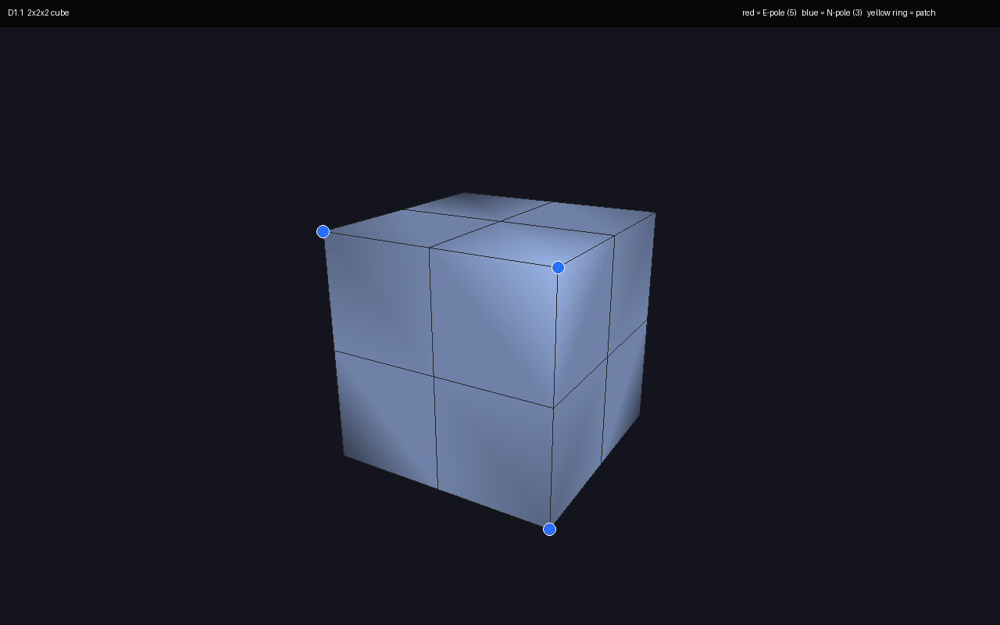

Du setzt drei Loop-Schnitte (Loop Insert), je einen quer zu jeder Achse; jeder läuft einmal rund um den Würfel. Aus 6 Flächen werden 24 Vierecke.
Die acht Würfelecken sind blaue N-Pole (3 Kanten); alle anderen Punkte haben 4 Kanten.

### Bild 2 — Vier Spalten pro Kopfhälfte  (Schritt D2.1)
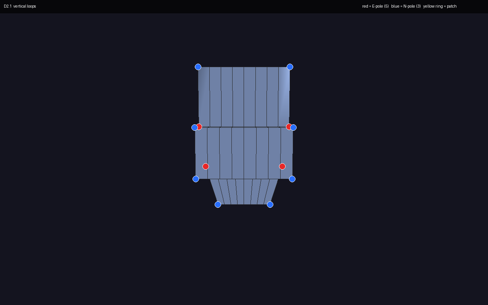

Sechs senkrechte Loop-Schnitte teilen die Vorderseite in 8 Spalten (4 pro Hälfte). Jeder Schnitt läuft rund um den ganzen Kopf, bis in den Nacken —
das ist hier gewollt. Die Spiegelachse liegt auf einer Punktspalte in der Mitte, nicht auf einer Fläche.

### Bild 3 — Die Linien an ihren Platz schieben  (Schritt D2.3)
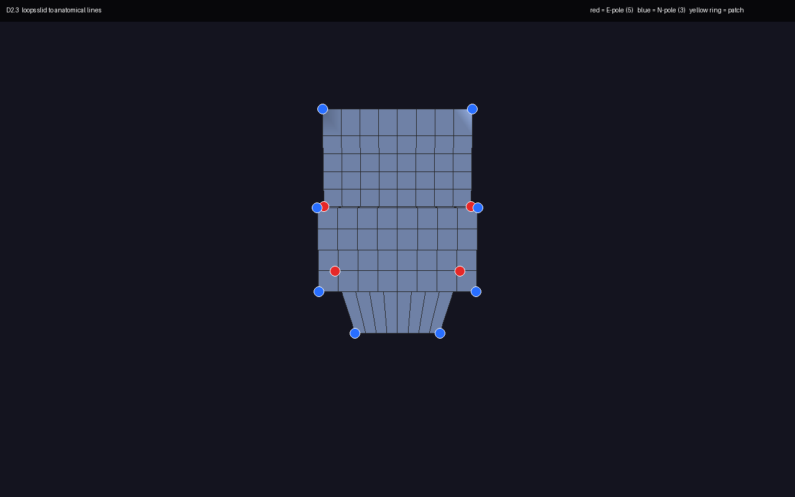

Die waagerechten Linien (Stirn, Braue, zwei Augenreihen, Wangenknochen) werden mit Loop Slide an ihre anatomische Höhe geschoben. Es entstehen
keine neuen Kanten, nur die Abstände ändern sich. Das geht nur, solange die Linie noch durch keinen Pol läuft — also **bevor** die Augen und der Mund angelegt werden.

### Bild 4 — Schnauze ausziehen  (Schritt D3.2)
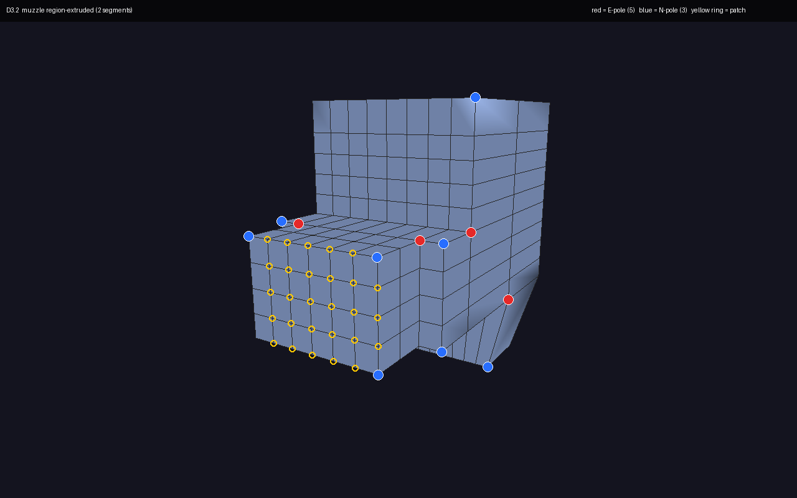

Du wählst das Feld aus 6 × 4 Flächen (3 Spalten pro Hälfte, 4 Zeilen) und ziehst es mit Extrude in zwei Schritten nach vorn. Rund um die Schnauze entsteht ein geschlossener Ring aus 20 Kanten.
Genau an den vier Ecken des Feldes liegen rote E-Pole; auf der Mitte liegt kein Pol. Vorn an den Ecken der Schnauzenfläche sitzen vier blaue N-Pole.

### Bild 5 — Schnauzenfläche verkleinern und kippen  (Schritt D3.3)
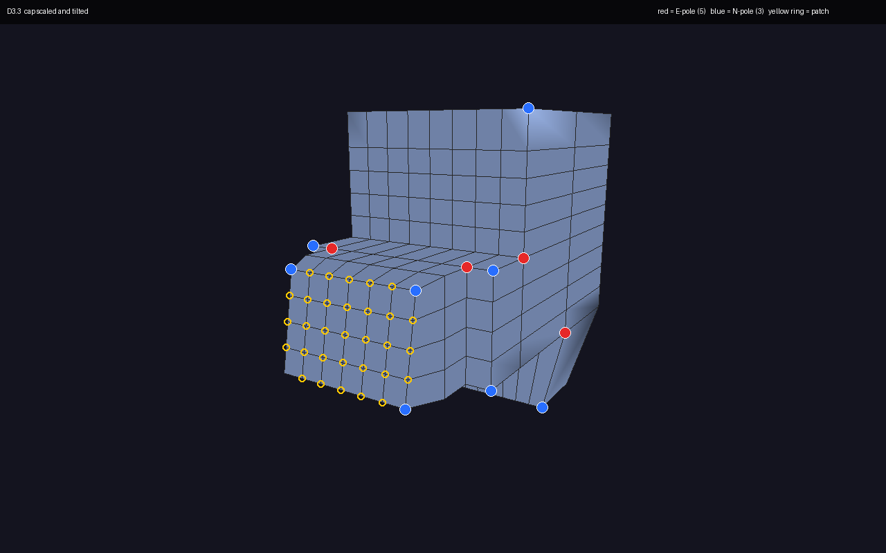

Die vordere Fläche wird mit Skalieren etwas kleiner gemacht und mit Rotieren leicht gekippt. Das ist reine Formarbeit: Das Netz und die Pole bleiben, wo sie sind.

### Bild 6 — Nase  (Schritt D4.2)
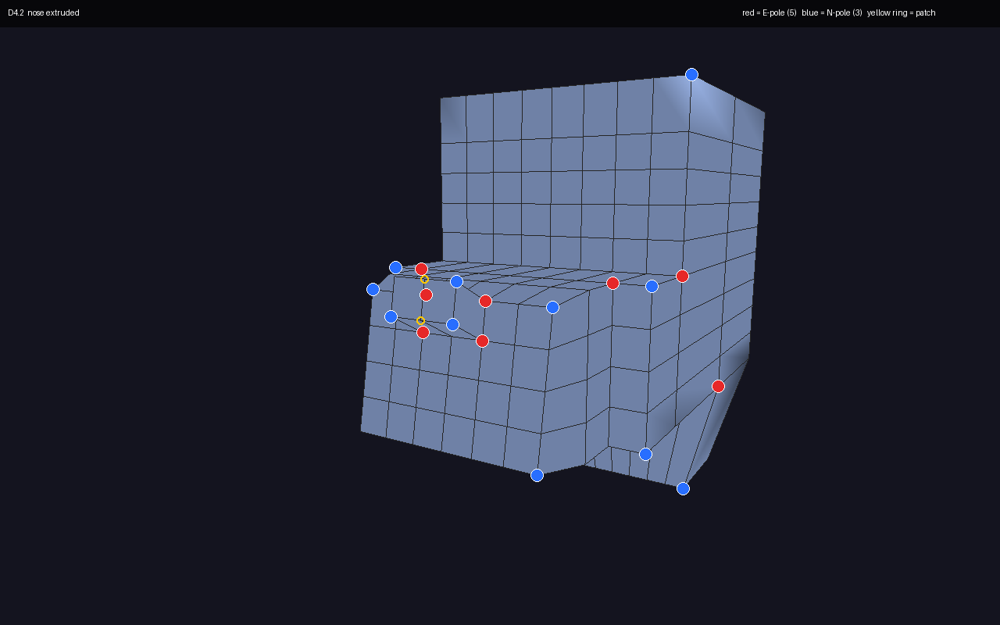

Du wählst die zwei mittleren Flächen der obersten Schnauzenreihe und ziehst sie nach vorn und leicht nach oben. Der Ring um die Nasenbasis hat 6 Kanten,
an seinen vier Ecken sitzen rote E-Pole. Die Unterseite lässt du zunächst in Ruhe.

### Bild 7 — Augenfelder vorbereiten, erster Ring  (Schritt D5.2)
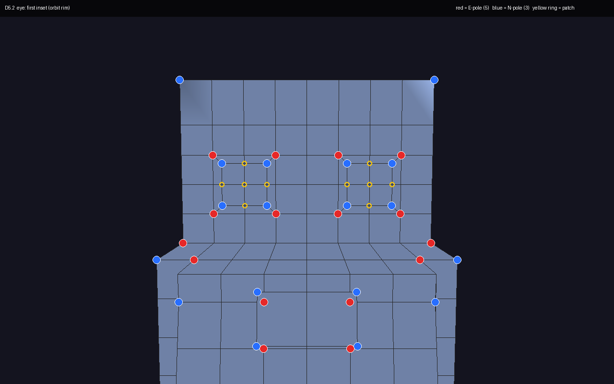

Pro Auge wählst du 2 × 2 Flächen (ein Ring aus 8 Kanten). Extrude mit Abstand 0 und Skalieren auf etwa 70 % legt einen neuen Ring in das Feld.
Die vier roten E-Pole liegen genau auf den Ecken des 2 × 2-Feldes; die beiden Augenwinkel (Mitte links und rechts) haben ganz normale 4 Kanten. Innen sitzen vier blaue N-Pole.

### Bild 8 — Zweiter Ring  (Schritt D5.3)

Dasselbe noch einmal auf der inneren Fläche. Die roten E-Pole bleiben unverändert; die blauen N-Pole wandern einen Ring nach innen mit.
Pro Auge bleibt die Zahl der Pole gleich: 4 rote, 4 blaue.

### Bild 9 — Dritter Ring  (Schritt D5.4)

Ein dritter Ring, wieder mit Extrude 0 und Skalieren. Wieder bleiben die roten Pole stehen und nur die blauen rutschen nach innen.
Jetzt hast du drei Ringe um das Auge, alle mit 8 Kanten.

### Bild 10 — Tiefe für das Auge  (Schritt D5.5)
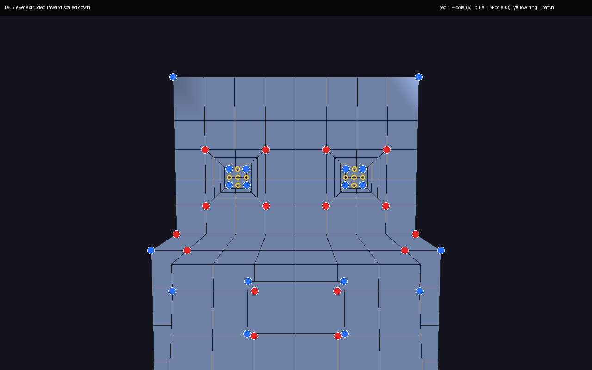

Die innerste Fläche wird nach innen (in den Schädel) extrudiert und kleiner skaliert. So bekommt das Auge Lidstärke und Tiefe. Die Zahl der roten Pole ändert sich nicht.
(Die Fläche wieder zu löschen, um ein Loch zu öffnen, geht mit den heutigen Werkzeugen nicht — das steht in den Findings.)

### Bild 11 — Mundfeld, erster Ring  (Schritt D6.2)
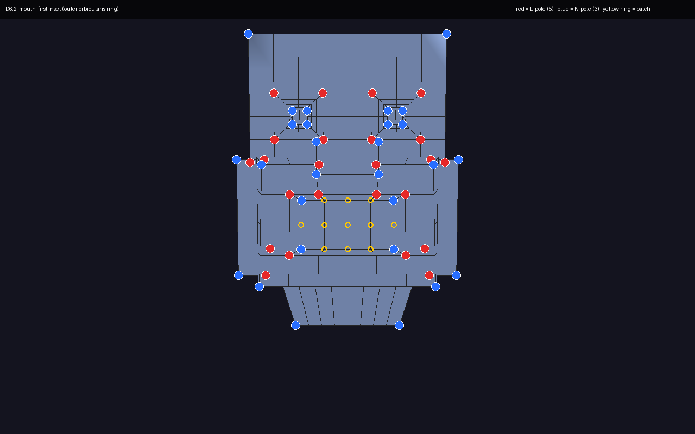

Auf der Schnauze wählst du 4 × 2 Flächen (Ring aus 12 Kanten) und machst Extrude 0 mit Skalieren. Vier rote E-Pole sitzen auf den Ecken des Feldes (zwei pro Seite).
Der Mundwinkel liegt auf der Mitte der kurzen Seite und hat 4 Kanten, also keinen Pol.

### Bild 12 — Zweiter und dritter Mundring  (Schritte D6.3 und D6.4)

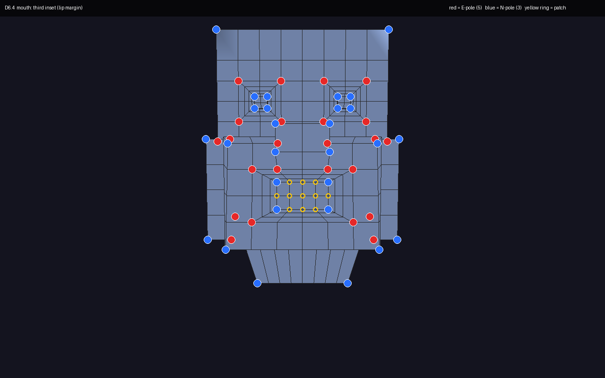

Zweimal derselbe Handgriff: Extrude 0, Skalieren. Es entstehen der Ring an der Lippenkante und der Ring am Lippenrand. Die roten Pole an den Mundfeld-Ecken bleiben, die blauen wandern nach innen.

### Bild 13 — Lippendicke  (Schritt D6.5)

Die innerste Mundfläche wird ein Stück nach innen extrudiert und leicht verkleinert. Das gibt den Lippen Dicke. Auch hier ändert sich bei den roten Polen nichts.

### Bild 14 — Braue nach vorn  (Schritt D8.1)
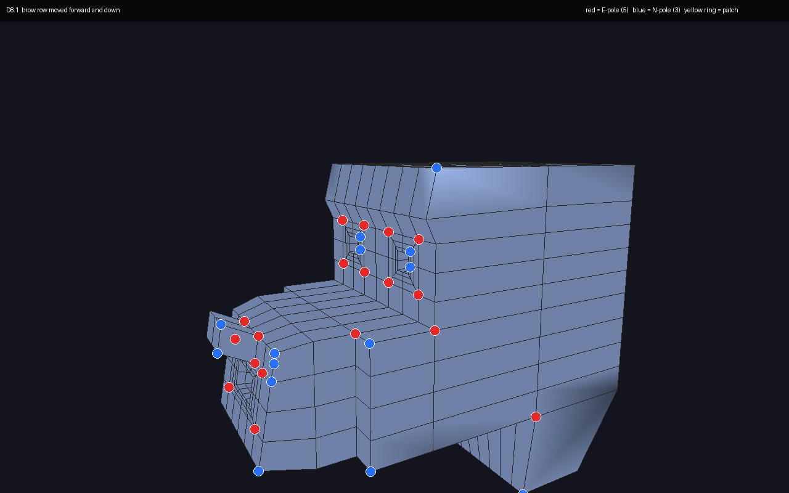

Du wählst die Linie zwischen Stirn und Braue mit der Edge-Loop-Auswahl (sie schließt sich rund um den Kopf, weil sie keinen Pol berührt) und verschiebst ihren vorderen Teil nach vorn und etwas nach unten.
Es entstehen keine neuen Kanten und keine neuen Pole — die Brauenform kommt aus der Position.

### Bild 15 — Augenring verschieben  (Schritt D8.2)

Der erste Ring um das Auge (8 Kanten, ohne Pol) lässt sich mit Loop Slide innerhalb des Rahmens zwischen äußerem und innerem Ring verschieben. Nur die Abstände ändern sich.
Das gilt für beide Augen; du machst es einmal pro Seite.

### Bild 16 — Eine Zusatzlinie um das Auge  (Schritt D8.3)
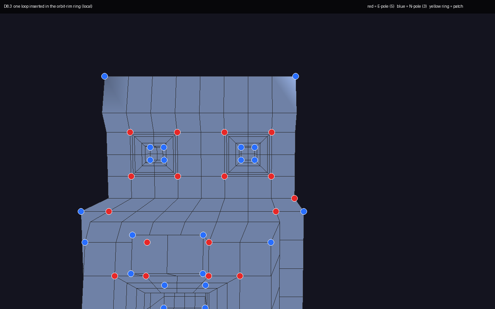

Wenn die Braue eine härtere Kante braucht, setzt du mit Loop Insert einen Schnitt durch den Rahmen um das Auge. Er läuft nur um das Auge herum (8 neue Punkte pro Auge),
verschiebt nichts und lässt die Zahl der Pole unverändert.

### Bild 17 — Ohr  (Schritt D9.3, Teile c und d)
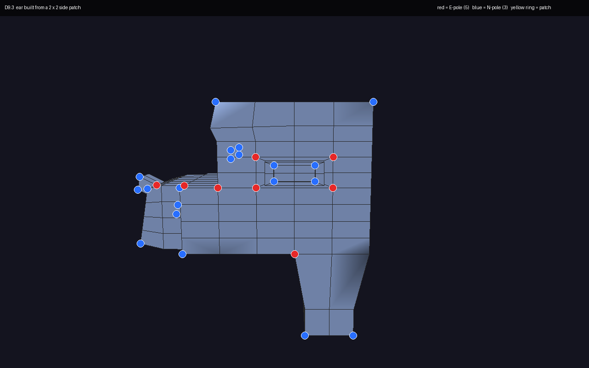

Auf der Kopfseite wählst du 2 × 2 Flächen, machst einen Inset (Extrude 0 + Skalieren, der Ohransatz-Ring), ziehst das Feld nach außen, machst darauf einen zweiten Inset für den Ohrrand und ziehst die Mitte etwas nach innen.
Vier rote E-Pole liegen am Ohransatz, also in der wenig bewegten Zone seitlich am Schädel. **Vorbereitung:** Dafür waren zwei zusätzliche Loop-Schnitte um den Kopf nötig, die im Dokument nicht stehen (siehe FINDINGS F-08).

---

## Was in diesem Entwurf fehlt — und warum

Diese Schritte sind nicht aufgenommen, weil sie abwichen oder nicht möglich waren: Blockout mit Schnauze und Hals (D1.3, D1.5), die Zeilenzahl der Vorderseite (D2.2), Augen- und Mundlöcher öffnen
(D5.6, D6.6, nicht möglich), Pole zählen und verschieben (D7.1 bis D7.4), Kiefer-Linie schieben (D9.1), Nasenlöcher (D10.3) und die Unterteilung (D11.1). Details: [FINDINGS.md](FINDINGS.md).

Nächster Schritt dieses Entwurfs: Manu schaut ihn durch und gibt ein Verdikt (KEEP / ITERATE / REJECT / UNKNOWN). Bis dahin gilt: **UNKNOWN**.
